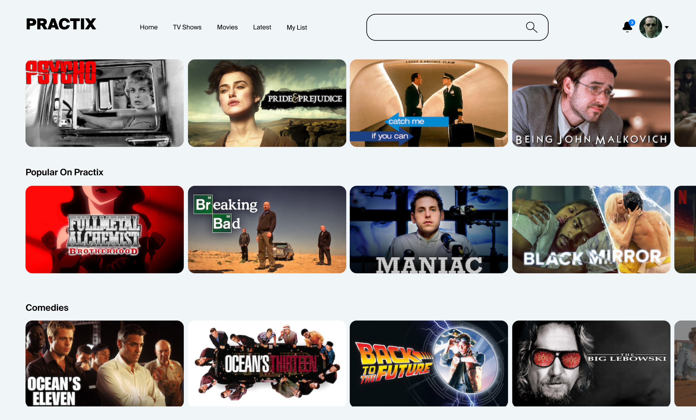
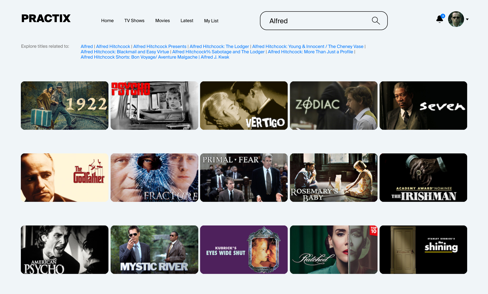
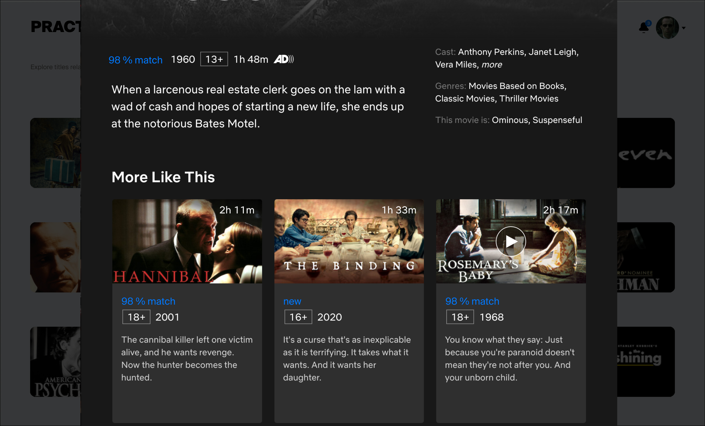
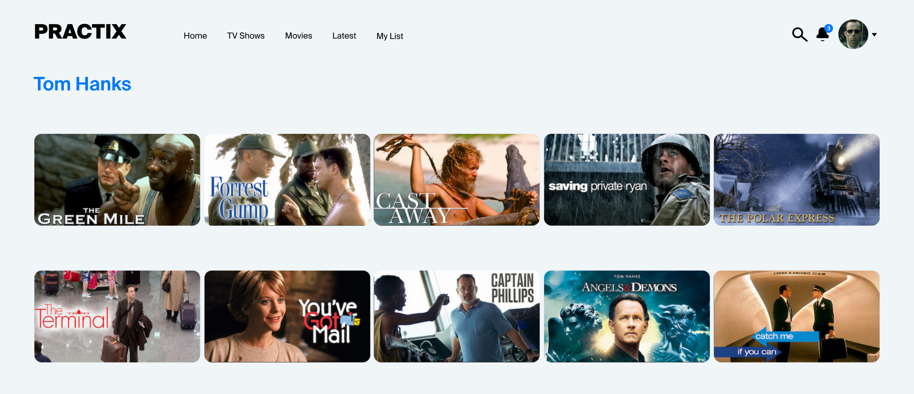
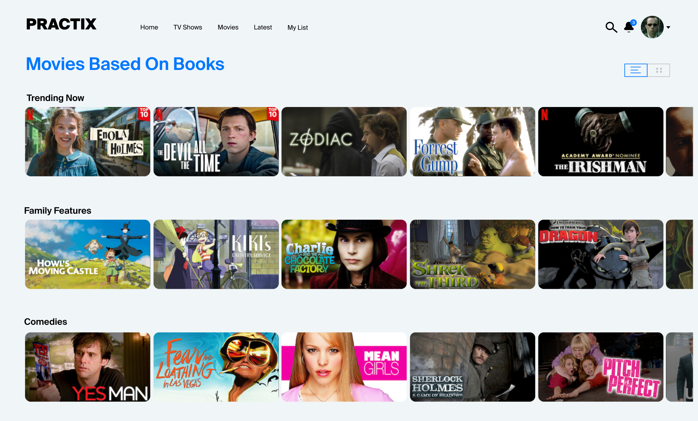
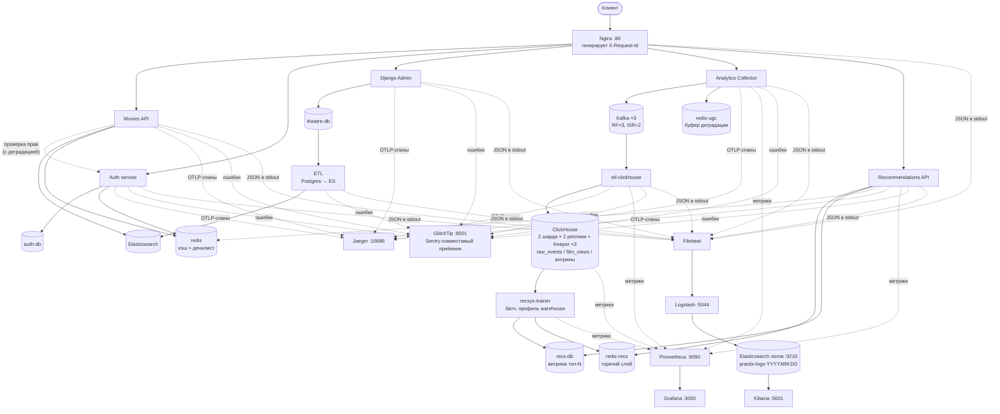
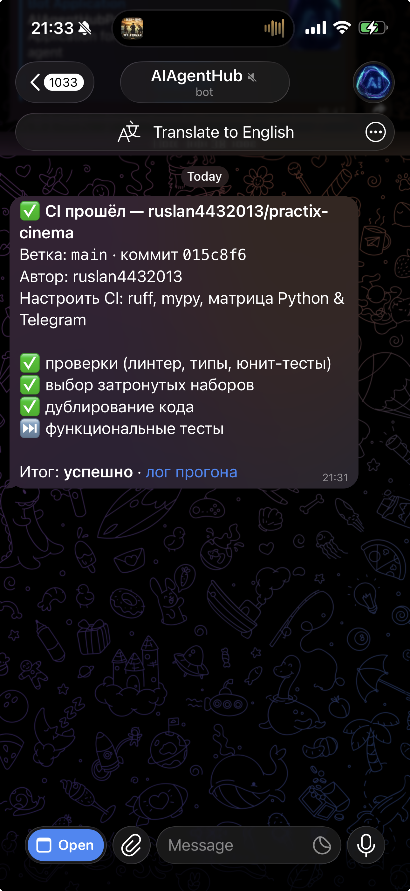

# 🎬 Async API — Онлайн-кинотеатр

Асинхронная платформа онлайн-кинотеатра: read-only API поиска фильмов, сервис авторизации с JWT и ролями, админка Django, пользовательский контент (оценки, закладки, рецензии), сбор пользовательских действий в Kafka, рассылки с подтверждением email по коротким ссылкам, рекомендации (похожие фильмы, персональные подборки, популярное), аналитическое хранилище на ClickHouse и полная observability-обвязка. **Nx-монорепозиторий**: сервисы в `apps/`, общий код в `libs/`, инфраструктура в `infra/`. Стенд поднимается одним `infra/compose/docker-compose.yml` за Nginx. Python 3.13 (админка Django — 3.12).

[Ссылка на репозиторий](https://github.com/ruslan4432013/practix-cinema)

---

## Экраны приложения

**Главная страница** — популярные фильмы по рейтингу



**Поиск** — полнотекстовый поиск по фильмам и персонам



**Страница фильма** — описание, жанры, актёры, режиссёры, сценаристы



**Страница персоны** — имя, роли и фильмография



**Страница жанра** — описание жанра и популярные фильмы в нём



**Основные сущности:** фильм (название, описание, рейтинг, жанры, актёры,
режиссёры, сценаристы), персона (роли и фильмография), жанр, пользователь и роль
(RBAC, история входов, привязанные соцаккаунты).

---

## Архитектура



Схема выше — **магистральный путь данных, а не карта стенда**: UGC API, короткие
ссылки, рассылки и websocket-шлюз на ней намеренно не показаны. Пять узлов со
своими базами превратили бы поток во вторую копию карты — а карта уже есть, и
две пришлось бы держать в согласии друг с другом.

Одиннадцать Python-сервисов плюс админка Django; со всеми профилями стенд — это
58 контейнеров (28 из них ядро), из них четыре узла ClickHouse. Полный состав
стенда, порты и хранилища — в [`docs/architecture.md`](docs/architecture.md).

---

## Что интересного внутри

* **Сайт не падает, если падает Auth** — retry с backoff, circuit breaker на Redis, fallback на локальный бэкенд в админке.
* **Приём событий не отвечает 5xx никогда** — при недоступной Kafka событие уходит в крашоустойчивый буфер Redis и доставляется после восстановления.
* **Данные не теряются при отказе ClickHouse** — оффсеты коммитятся только после вставки, чтение из Kafka ставится на паузу, сама Kafka играет роль неограниченного буфера.
* **Дедупликация в три уровня** — `set` по `event_id` в пачке → `insert_deduplication_token` → `ReplacingMergeTree`.
* **Уведомление доходит, даже когда websocket отвалился** — изящная деградация в три ступени: сокет → long polling → долговечная лента кабинета, склейка по `task_id`.
* **Блок рекомендаций не роняет страницу фильма** — лестница деградации Redis → PostgreSQL → последнее известное популярное из памяти процесса → 200 с пустым списком, и ответ всегда называет свой источник.
* **Рекомендации считает ночной батч, а выдача только читает** — шов между ними витрина топ-N, версия батча входит в первичный ключ каждой таблицы: повторный прогон физически не может удвоить строки, а выдача видит целостный батч.
* **Один `request_id` от Nginx до строки лога** — общий идентификатор связывает трейс в Jaeger, ошибку в GlitchTip и логи в Kibana.
* **Преагрегат рейтинга вместо агрегации на лету** — разница в 13 раз на популярном фильме; лайки выводятся из гистограммы по настраиваемому порогу, а не хранятся.
* **Исследование хранилища под UGC на 10 млн оценок** — MongoDB vs PostgreSQL vs ClickHouse, честные замеры p99 на живом шардированном кластере.

Развёрнуто, по спринтам: [`docs/features.md`](docs/features.md).

---

## Метрики

Movies API под `wrk` (200 000 фильмов в Elasticsearch, кэш Redis):

| Соединений | p50 | p99 | RPS |
|------------|-----|-----|-----|
| 200 | 43 ms ✅ | 58 ms ✅ | ~4 500 |
| 500 | 61 ms ✅ | 145 ms ✅ | ~6 500 |
| 1 000 | 127 ms ✅ | 356 ms ❌ | ~7 000 |
| 10 000 | 719 ms ❌ | 1.93 s ❌ | ~6 600 |

При ≤ 500 одновременных соединениях p99 < 200 мс. Для 10k соединений необходимо
горизонтальное масштабирование.

Исследование хранилища под UGC на датасете 10 млн оценок / 1 млн закладок /
500 тыс. рецензий: требование 200 мс проходят все три кандидата, **PostgreSQL
выигрывает у MongoDB по p99 во всех одиннадцати сценариях** — от 2.9× на списке
понравившихся фильмов до 169× на рецензиях, отсортированных по полезности
(152.3 против 0.9 мс). Отсюда и выбор хранилища для `apps/ugc-api/`.
Методика и полные таблицы — [`research/ugc-storage/`](research/ugc-storage/README.md).

Качество рекомендаций против baseline «просто популярное» (5000 синтетических
зрителей, 999 реальных фильмов, отложенная **по времени** выборка, k=10):
со-встречаемость даёт precision@10 **0.0527** против 0.0048 у baseline и покрытие
каталога **84 %** против 1 %, ALS — 0.0471 и 85 %. Обе модели обгоняют baseline
примерно на порядок по точности и на два по покрытию; методика и оговорки про
синтетику — [`docs/recommendations.md`](docs/recommendations.md).

Выдача рекомендаций под нагрузкой (k6, проектные 100 RPS с восьми адресов,
плато 60 с, витрина на 49 719 зрителях): **p95 43,9 мс** при SLO 200 мс,
**p99 47,8 мс** при SLO 300 мс, ноль 5xx и ноль 429 на 6 000 запросов. Ночной
батч обучения — **19,5 с** на 494 661 взаимодействии при SLO «< 2 ч». Парный
прогон с одного адреса отдаёт 70% отказов, то есть лимитер при этом жив, а не
выключен ради красивой цифры. Условия и оговорки —
[`docs/recommendations.md`](docs/recommendations.md#замеры-slo).

Дублирование кода — **0.65 %** против 4.53 % до переезда на монорепозиторий, с
жёстким гейтом `jscpd` в CI.

---

## Быстрый старт

```bash
cp .env.example .env
DC="docker compose --env-file .env -f infra/compose/docker-compose.yml --project-directory infra/compose"

$DC up -d --build                    # ядро: 28 сервисов
#   + --profile warehouse       ClickHouse, Keeper, ETL ClickHouse, обучение рекомендаций
#   + --profile observability   Prometheus, Grafana, Kafka UI, GlitchTip
#   + --profile logging         Elasticsearch (логи), Logstash, Kibana, Filebeat
#   + --profile notifications   Панель рассылок, сборщик, отправитель, планировщик,
#                               websocket-шлюз, RabbitMQ, Mailpit

uv run --with psycopg2-binary --with faker python seed_db.py   # тестовые данные
```

Выдача рекомендаций живёт в **ядре** (её маршрутизирует nginx, а тот резолвит
апстримы на старте), а обучение — в профиле `warehouse`, рядом с ClickHouse,
из которого оно читает просмотры. Без профиля витрина пуста, выдача отдаёт
популярное, и страница фильма цела.

Полный сценарий (суперпользователь, сквозная проверка события до витрин в
ClickHouse, проверка отказоустойчивости и утечек памяти, полезные адреса) —
[`docs/quickstart.md`](docs/quickstart.md). Всем профилям вместе Docker нужно
выделить ≥16 ГБ RAM (без профиля `logging` — ≥12 ГБ).

Открыть после запуска: Swagger Movies API — http://localhost/api/openapi,
Swagger рекомендаций — http://localhost/api/recommendations/openapi,
Jaeger — http://localhost:16686, Grafana — http://localhost:3000,
Kibana — http://localhost:5601 (профиль `logging`),
панель рассылок — http://localhost:8090/admin/ (профиль `notifications`),
витрина деградации websocket → polling — http://localhost:8090/demo/cabinet.

---

## Непрерывная интеграция

Шесть job на каждый PR в `main` (других триггеров нет — ветка защищена, и код
попадает в неё только через PR): гейты целостности, `nx affected` (ruff + mypy +
тесты) на матрице Python 3.13/3.14, HTML-отчёт по линтерам артефактом прогона
(ruff + wemake-python-styleguide + mypy), проверка дублирования, функциональные
наборы по одному на раннер и уведомление об итоге в Telegram. Статус каждой job
отдельной строкой, `⏭` у функциональных тестов означает, что `nx affected` не
выбрал ни одного набора:



Устройство пайплайна, гейты и уведомление — [`docs/quality.md`](docs/quality.md).

---

## Документация

| Документ | О чём |
|---|---|
| [`docs/architecture.md`](docs/architecture.md) | Состав стенда: сервисы, порты, хранилища, one-shot задачи, volumes |
| [`docs/features.md`](docs/features.md) | Возможности по спринтам: Auth, трассировка, ошибки, логи, UGC, ETL |
| [`docs/quickstart.md`](docs/quickstart.md) | Полный запуск, сквозная проверка, отказоустойчивость, адреса |
| [`docs/api.md`](docs/api.md) | Ключевые эндпоинты всех сервисов |
| [`docs/configuration.md`](docs/configuration.md) | Переменные окружения по группам |
| [`docs/testing.md`](docs/testing.md) | Юнит, функциональные и нагрузочные тесты |
| [`docs/quality.md`](docs/quality.md) | Линт, типы, дублирование, проверки целостности, CI |
| [`docs/monorepo.md`](docs/monorepo.md) | Устройство монорепозитория, решения и ловушки |
| [`docs/notifications.md`](docs/notifications.md) | Проектное решение сервиса нотификаций (задания спринта 10) |
| [`docs/websockets.md`](docs/websockets.md) | Websocket-шлюз мгновенных уведомлений и деградация на long polling |
| [`docs/recommendations.md`](docs/recommendations.md) | Рекомендательная система: витрина, лестница деградации, качество моделей (дипломный трек) |

Документация сервисов: [Auth](apps/auth/README.md) ·
[Analytics Collector](apps/analytics-collector/README.md) ·
[ETL ClickHouse](apps/etl-clickhouse/README.md) ·
[UGC API](apps/ugc-api/README.md) ·
[Нотификации](apps/notifications/README.md) ·
[Websocket-шлюз](apps/notifications-ws/README.md) ·
[Сокращение ссылок](apps/link-shortener/README.md) ·
[Recommendations API](apps/recommendations-api/README.md) ·
[Recsys Trainer](apps/recsys-trainer/README.md) ·
[ELK](infra/elk/README.md) ·
[Исследование хранилища UGC](research/ugc-storage/README.md) ·
[Нагрузочные тесты](loadtests/README.md)
