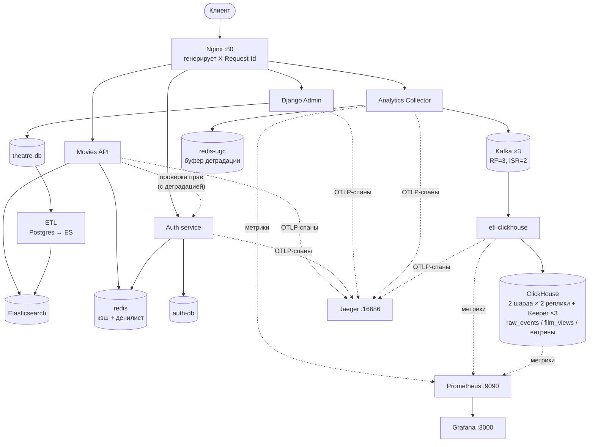

# 🎬 Async API — Онлайн-кинотеатр

Асинхронная платформа онлайн-кинотеатра: read-only API поиска фильмов, сервис авторизации с JWT и ролями, админка Django, ETL-конвейер и полная observability-обвязка. **Nx-монорепозиторий**: сервисы в `apps/`, общий код в `libs/`, инфраструктура в `infra/`. Стенд поднимается одним `infra/compose/docker-compose.yml` в bridge-сети `movies_net` за Nginx. Python 3.13 (админка Django — 3.12). Устройство репозитория и принятые решения — в [`docs/monorepo.md`](docs/monorepo.md).

[Ссылка на репозиторий](https://github.com/ruslan4432013/ugc_sprint_1)

---

## О сервисе

Async API — платформа для онлайн-кинотеатра. Movies API предоставляет информацию о фильмах, жанрах и людях, участвовавших в их создании; Auth-сервис отвечает за пользователей, роли и сессии; Django Admin — за наполнение контентом. В спринте 2 сервисы интегрированы между собой с **graceful degradation** (сайт не падает, если Auth недоступен), добавлены распределённая трассировка, rate limiting, вход через соцсети и партиционирование таблиц.

### Экраны приложения

**Главная страница** — популярные фильмы по рейтингу


**Поиск** — полнотекстовый поиск по фильмам и персонам


**Страница фильма** — описание, жанры, актёры, режиссёры, сценаристы


**Страница персоны** — имя, роли и фильмография


**Страница жанра** — описание жанра и популярные фильмы в нём


### Основные сущности

- **Фильм** — название, описание, рейтинг, жанры, актёры, режиссёры, сценаристы
- **Персона** — имя, роли (актёр / режиссёр / сценарист), фильмография
- **Жанр** — название, описание
- **Пользователь / Роль** — учётные записи, роли (RBAC), история входов, привязанные соцаккаунты

---

## Архитектура



Analytics Collector проверяет JWT **локально** общим секретом, без сетевых
вызовов в Auth, поэтому его недоступность не влияет на приём событий.

### Сервисы и порты

| Сервис | Путь | Дистрибутив | Роль | Порт | `OTEL_SERVICE_NAME` |
|--------|------|-------------|------|------|---------------------|
| **Movies API** (`api`) | `apps/movies-api/` | `practix-movies-api` | Read-only films/genres/persons API (8 uvicorn workers) | expose 8000 | `movies-api` |
| **Auth** (`auth`) | `apps/auth/` | `practix-auth` | Пользователи, роли, JWT-сессии, OAuth | expose 8000 | `auth-service` |
| **Django Admin** (`django-admin`) | `apps/django-admin/` | вне workspace (Python 3.12) | Админка + внутренний content API | expose 8000 | `django-admin` |
| **Analytics Collector** | `apps/analytics-collector/` | `practix-analytics-collector` | Сбор пользовательских действий → Kafka (4 uvicorn workers) | expose 8000 | `analytics-collector` |
| **ETL ClickHouse** | `apps/etl-clickhouse/` | `practix-etl-clickhouse` | Конвейер Kafka → ClickHouse | host `9101` → 8000 (`/metrics`) | `etl-clickhouse` |
| **ETL Elasticsearch** (`etl`) | `apps/etl-elasticsearch/` | `practix-etl-elasticsearch` | Конвейер PostgreSQL → Elasticsearch (не путать с предыдущим) | — | — |
| **Nginx** (`nginx`) | `infra/nginx/` | `nginx:1.25.3` | Reverse proxy / балансировщик, точка входа | published **80** | — |

Все пять Python-сервисов собираются ОДНИМ `infra/docker/python-service.Dockerfile`
(пять `--target`). У админки Django свой Dockerfile: она на Python 3.12, вне
общего uv workspace и со своим `uv.lock`.

Общий код — библиотеки в `libs/`: `practix-core` (логирование, request-id,
трассировка, backoff, обвязка JWT, определение IP клиента, пагинация),
`practix-contracts` (словарь событий и топиков, версионируется каталогами),
`practix-search-schema` (схемы индексов Elasticsearch), `practix-testing`
(фикстуры и скрипты ожидания сервисов).

### Хранилища и инфраструктура

| Компонент | Образ | Порт | Назначение |
|-----------|-------|------|-----------|
| **theatre-db** | `postgres:16` | `5432` | Фильмы (сид из `database_dump.sql`) |
| **auth-db** | `postgres:16` | host `5433` → `5432` | БД сервиса авторизации |
| **elasticsearch** | `9.4.1` | `9200` | Поисковый индекс Movies API |
| **redis** | `redis:7-alpine` | `6379` | Кэш Movies API + denylist/сессии/rate-limit Auth. `maxmemory` + `volatile-lru`: под давлением вытесняются ключи кэша (у них есть TTL) |
| **redis-ugc** | `redis:7-alpine` | — (только внутри сети) | Аналитика: буфер деградации, rate limit и дедупликация коллектора. Отдельный экземпляр, чтобы многочасовой отказ Kafka не вытеснял сессии Auth. Политика `noeviction` — потерять ещё не доставленные события молча хуже, чем отбросить их с метрикой |
| **kafka-0/1/2** | `apache/kafka:3.9.1` | host `9094`/`9095`/`9096` → `9094` | Кластер KRaft из трёх узлов (broker + controller), RF=3, `min.insync.replicas=2` |
| **kafka-ui** | `kafbat/kafka-ui` | `8081` → `8080` | Просмотр топиков, партиций и сообщений |
| **jaeger** | `jaegertracing/all-in-one:1.62.0` | UI `16686`, OTLP gRPC `4317`, OTLP HTTP `4318` | Сбор и просмотр трассировок |
| **clickhouse-01…04** | `clickhouse/clickhouse-server:25.3` | host `8123`/`8124`/`8125`/`8126` → `8123` | Аналитическое хранилище: 2 шарда × 2 реплики |
| **clickhouse-keeper-01…03** | `clickhouse/clickhouse-keeper:25.3` | `9181` | Кворум координации репликации и `ON CLUSTER`-DDL |
| **prometheus** | `prom/prometheus:v3.1.0` | `9090` | Метрики ETL, коллектора и всех узлов ClickHouse + алерты |
| **grafana** | `grafana/grafana:11.5.0` | `3000` | Дашборд «UGC ETL → ClickHouse» (память, лаг, вставки) |

**Вспомогательные one-shot сервисы:** `auth-migrations` (`alembic upgrade head`), `django-migrations` (`migrate` + `collectstatic` + `createsuperuser`), `kafka-init` (идемпотентное создание топиков UGC) и `clickhouse-init` (идемпотентное применение DDL хранилища). Порядок запуска определяется healthcheck'ами и `depends_on`.

**Volumes:** `pg_data`, `redis_data`, `redis_ugc_data`, `esdata`, `etl_state`, `static_volume`, `auth_pg_data`, `kafka_0_data`, `kafka_1_data`, `kafka_2_data`, `ch_01_data`…`ch_04_data`, `ch_keeper_01_data`…`ch_keeper_03_data`, `prometheus_data`, `grafana_data`.

> **Ресурсы.** Полный стек — это около двух десятков контейнеров, из них четыре
> узла ClickHouse. Docker нужно выделить **не менее 12 ГБ RAM**; ограничения
> памяти самих узлов заданы в `clickhouse/config/limits.xml`.

> **Две схемы именования настроек.** Movies API использует настройки в **нижнем регистре** (`settings.redis_host`), Auth — в **ВЕРХНЕМ** (`settings.REDIS_HOST`). Не копируйте имена полей между сервисами. Конфигурация всех сервисов (включая Django admin — через `example/config.py`) построена на **pydantic-settings**.

---

## Возможности спринта 2

### 1. Интеграция Auth + graceful degradation

Auth — «горячая» зависимость, поэтому вся интеграция построена так, чтобы сайт **не падал при недоступности Auth**. Используемые паттерны: retry с экспоненциальным backoff, circuit breaker, fallback / partial results.

- **Movies API** локально валидирует JWT (общий `authjwt_secret_key`) **и** делает живую межсервисную проверку прав `POST http://auth:8000/api/v1/users/check-permissions`. Роли кэшируются в Redis (`user:{id}:roles`, TTL 300 с). Проверка защищена **circuit breaker'ом на Redis** (`auth:cb:failures`, порог отказов + окно сброса) и короткими таймаутами (`auth_request_timeout = 2.0 с`) — если Auth недоступен, детали фильмов деградируют мягко, без жёсткого отказа.
- **Django Admin** — кастомный `AuthServiceBackend` аутентифицирует пользователя через Auth (`/api/v1/auth/login`, затем `/api/v1/users/me`), маппит роли Auth → `is_staff` / `is_superuser`, использует ограниченный retry + экспоненциальный backoff и таймауты, а при недоступности Auth **откатывается на локальный `ModelBackend`**.

### 2. Распределённая трассировка → Jaeger

Все три app-сервиса (auth / api / django) экспортируют OpenTelemetry-спаны по OTLP/HTTP в `http://jaeger:4318/v1/traces` (включается флагом `OTEL_ENABLED`). Инструментированы FastAPI + httpx (и Django + requests), поэтому `traceparent` пробрасывается сквозь межсервисные вызовы.

Корреляция через **X-Request-Id**: Nginx генерирует/перезаписывает его (`$request_id`, защита от подмены), каждый сервис требует заголовок (400, если отсутствует), проставляет его в активный спан, возвращает в ответе и пробрасывает в исходящие межсервисные вызовы. Трейсы доступны в UI: **http://localhost:16686**.

### 3. Rate limiting

Auth-сервис применяет **fixed-window** ограничитель на Redis (`RateLimitMiddleware`), настраиваемый через `RATE_LIMIT_ENABLED` / `RATE_LIMIT_TIMES` (по умолчанию 20) / `RATE_LIMIT_SECONDS` (по умолчанию 60).

### 4. Вход через соцсети (Yandex OAuth) + отвязка

Функциональность включается флагом `OAUTH_ENABLED`. Эндпоинты под `/api/v1/oauth`:

- `GET /yandex/login` — редирект на Yandex, CSRF-`state` хранится в Redis.
- `GET /yandex/callback` — валидация `state`, обмен `code`, выпуск наших JWT.
- Новые/существующие пользователи связываются через таблицу `social_accounts`; OAuth-only пользователи создаются без пароля (passwordless).
- `GET /social/accounts` — список привязанных аккаунтов.
- `DELETE /social/accounts/{account_id}` — отвязать аккаунт (блокируется с **409**, если это оставит passwordless-пользователя без способа входа).

Настройки: `YANDEX_CLIENT_ID` / `YANDEX_CLIENT_SECRET` / `YANDEX_REDIRECT_URI`.

### 5. Партиционирование таблиц

Таблица `login_history` партиционирована **в два уровня**: RANGE по `auth_date` (по годам) → LIST по `device_type` (`web` / `mobile` / `smart` + default). Тип устройства определяется по `User-Agent` при входе. Смысл: на миллионах строк это даёт отсечение по временному диапазону для запросов истории плюс разделение по классам устройств.

---

## Возможности спринта 3: сбор пользовательских действий (UGC)

Сервис [`apps/analytics-collector/`](apps/analytics-collector/README.md) — аналог Яндекс.Метрики для кинотеатра. Принимает клики, просмотры страниц (с временем на них) и кастомные события (смена качества видео, досмотр до конца, использование фильтров поиска) и публикует их в Kafka.

**Топики** — по одному на семейство событий (стратегия «топик на тип сущности»): `ugc.clicks.v1`, `ugc.page_views.v1`, `ugc.video_events.v1`, `ugc.video_progress.v1`, `ugc.search_events.v1` плюс `ugc.events.dlq.v1`. Все с RF=3 и `min.insync.replicas=2`, создаются одноразовой задачей `kafka-init`. **Ключ партиционирования** — `user_id` (для анонимов `anonymous_id` → `session_id`): сохраняет порядок событий одного пользователя и даёт равномерное распределение.

**Graceful degradation.** Приём событий не ломается ни от чего: при недоступной Kafka событие уходит в ограниченный по длине буфер Redis (`202 {"status":"buffered"}`), а фоновый дренаж доставляет накопленное после восстановления. Дренаж крашоустойчив — записи извлекаются через `LMOVE` в in-flight-список и удаляются только после подтверждения брокером, поэтому перезапуск сервиса с непустым буфером ничего не теряет. Недоступность Redis отключает rate limit и дедупликацию (fail-open), но 5xx клиент не получает никогда.

**Безопасность.** `user_id` берётся только из подписи JWT — во входных моделях такого поля нет вовсе, и `extra='forbid'` превращает попытку его передать в 422. Сырой IP не покидает процесс: в Kafka уходит солёный `blake2b`. Ограничены размер тела (отсекается до чтения), размер пачки, длины строк и структура `properties`. Имя топика недоступно клиенту.

**Отличия от Auth и Movies API — осознанные:** `X-Request-Id` здесь *генерируется*, а не требуется (400 сломал бы `navigator.sendBeacon`, который не умеет ставить заголовки); лимит частоты выше и учитывает вес пачки; документация висит на `/api/analytics/openapi`, потому что `/api/openapi` за Nginx уже занят Movies API.

Подробнее: [требования](apps/analytics-collector/docs/requirements.md) · [архитектура и диаграммы](apps/analytics-collector/docs/architecture.md) · [топики](apps/analytics-collector/docs/kafka_topics.md) · [клиентский трекер](apps/analytics-collector/docs/client_snippet.md).

---

## Возможности спринта 4: аналитическое хранилище и ETL

Поток событий заканчивался ничем: Kafka — транспорт, а не архив (retention
7–30 дней), и ответить на продуктовые вопросы было нечем. Сервис
[`apps/etl-clickhouse/`](apps/etl-clickhouse/README.md) непрерывно переносит события в
ClickHouse и закрывает конвейер.

### Хранилище

**Кластер 2 шарда × 2 реплики** плюс кворум `ClickHouse Keeper` из трёх узлов.
Шардирование даёт масштаб, репликация — переживание отказа узла; одно без
другого бессмысленно. Keeper именно кворумный: при одном узле его падение
останавливает все вставки в реплицируемые таблицы и любой `ON CLUSTER`-DDL, и
«две реплики на шард» перестают что-либо значить.

Схема (DDL в `apps/etl-clickhouse/ddl/`, применяет одноразовый `clickhouse-init`):

| Таблица | Что содержит |
|---|---|
| `ugc.raw_events` | Сырой поток всех шести семейств событий; `payload` — как есть |
| `ugc.film_views` | Типизированные просмотры: `view_id`, `completion_rate`, `progress_pct` |
| `ugc.film_views_daily` | Витрина: **самые просматриваемые фильмы** |
| `ugc.film_retention_daily` | Витрина: **кривая досмотра — где именно бросают** |
| `ugc.film_completion_daily` | Витрина: доля брошенных просмотров, квантили досмотра |
| `ugc.invalid_events` | Карантин нераспознанных сообщений |

### Новое событие `video_progress`

Ответить на вопрос «какие фильмы не досматривают» по существующим событиям было
невозможно: `video_completed` приходит только у тех, кто **досмотрел**, а у
брошенного просмотра события просто нет. Поэтому добавлена периодическая метка
прогресса — последний увиденный бакет и есть точка выхода зрителя.

У неё **отдельный топик** `ugc.video_progress.v1` (12 партиций, retention 7
дней): при тике раз в 30 секунд двухчасовой фильм даёт ~240 событий на просмотр
против одного `video_completed`, и в общем топике этот firehose задавил бы
редкие, но ценные события плеера.

### Устойчивость к сбоям

**Источник.** Сервис поднимается при лежащей Kafka, переживает её пропажу в
работе и закрывает пачку до отдачи партиций при ребалансе.

**Хранилище.** Оффсеты коммитятся **только** после успешной вставки, а на время
недоступности ClickHouse чтение из Kafka ставится на паузу — в куче живёт ровно
одна пачка. Роль неограниченного буфера играет сама Kafka: там данные
реплицированы, лежат на диске и переживают перезапуск. Копить непрокоммиченные
пачки в памяти значило бы превратить часовой простой хранилища в OOM-kill — и
всё равно перечитывать с последнего коммита.

**Идемпотентность** — три уровня: `set` по `event_id` внутри пачки →
`insert_deduplication_token` из диапазонов оффсетов → `ReplacingMergeTree`.
Третий уровень отложенный, поэтому все витрины считают `uniq`, а не `count`.

**Отравленные сообщения** не блокируют конвейер: битый JSON, неизвестный тип
события или конверт более новой версии уезжают в `ugc.invalid_events`, а оффсет
коммитится вместе с пачкой.

### Мониторинг памяти

Поток непрерывный, поэтому важна не разовая цифра, а форма кривой: RSS обязан
выходить на плато. ETL отдаёт на `:9101/metrics` три независимых показателя —
`process_resident_memory_bytes` (RSS глазами ОС), `etl_ch_allocated_blocks`
(живые блоки CPython, не зависят от поведения аллокатора) и метрики
`tracemalloc` (за флагом `ETL_TRACEMALLOC_ENABLED`, топ-10 мест роста — в логи).
Prometheus собирает их вместе с метриками коллектора и всех узлов ClickHouse,
Grafana рисует дашборд «UGC ETL → ClickHouse», алерт `EtlMemoryGrowth` срабатывает
на устойчиво положительную производную RSS за три часа.

Подробнее: [ETL](apps/etl-clickhouse/README.md) · [схема хранилища и запросы аналитика](apps/etl-clickhouse/docs/analytics_schema.md) · [матрица отказов](apps/etl-clickhouse/docs/reliability.md).

---

## Быстрый старт

```bash
# 1. Поднять весь стек из корня репозитория
docker-compose up -d --build

# 2. Заполнить theatre-db тестовыми данными (110 жанров / 5 000 персон / 200 000 фильмов)
pip install psycopg2-binary faker && python seed_db.py

# 3. Создать суперпользователя в сервисе Auth (идемпотентно; создаёт роль 'admin', если её нет)
docker-compose exec auth python -m src.cli createsuperuser --login admin --email admin@example.com

# 4. Проверить сквозной путь события: отправить клик и найти его в ClickHouse
curl -X POST http://localhost/api/v1/events/click -H 'Content-Type: application/json' \
     -d '{"session_id":"demo","element_type":"film","page_url":"http://localhost/"}'
sleep 5   # ETL закрывает пачку по таймеру ETL_FLUSH_INTERVAL
docker compose exec clickhouse-01 clickhouse-client --user etl --password etl \
  -q "SELECT event_type, count() FROM ugc.raw_events GROUP BY event_type"
# промежуточные точки: http://localhost:8081 (Kafka UI), http://localhost:9101/metrics (ETL)

# 5. Метки просмотра и витрины: имитируем зрителя, бросившего фильм на середине
FILM=$(uuidgen | tr 'A-Z' 'a-z')
for POS in 0 12000 24000 36000 48000 60000; do
  curl -s -X POST http://localhost/api/v1/events/custom -H 'Content-Type: application/json' \
    -d "{\"event_type\":\"video_progress\",\"session_id\":\"demo\",\"film_id\":\"$FILM\",\
\"playback_position_ms\":$POS,\"duration_ms\":120000}" > /dev/null
done
sleep 5
docker compose exec clickhouse-01 clickhouse-client --user etl --password etl \
  -q "SELECT progress_pct, uniqMerge(views) FROM ugc.film_retention_daily \
      WHERE film_id='$FILM' GROUP BY progress_pct ORDER BY progress_pct"
# ожидаем бакеты 0,10,20,30,40,50 — ровно до той точки, где зритель ушёл

# Миграции Auth (Alembic) — сервис auth-migrations делает это автоматически при старте
cd auth && alembic upgrade head
```

ETL автоматически перенесёт данные из PostgreSQL в Elasticsearch, а
`etl-clickhouse` — поток пользовательских действий из Kafka в ClickHouse.

**Полезные адреса:**

- Swagger Movies API — http://localhost/api/openapi
- Swagger Auth — `/api/openapi` контейнера auth
- Jaeger UI — http://localhost:16686
- Kafka UI — http://localhost:8081
- Prometheus — http://localhost:9090 (вкладка Targets: все цели должны быть UP)
- Grafana — http://localhost:3000, дашборд «UGC ETL → ClickHouse» (`admin` / `$GF_SECURITY_ADMIN_PASSWORD`)
- ClickHouse HTTP — http://localhost:8123 (узлы 2–4 на портах 8124–8126)

### Проверка отказоустойчивости ETL

```bash
# Отказ ХРАНИЛИЩА: данные не теряются, а ждут в Kafka
docker compose exec clickhouse-01 clickhouse-client --user etl --password etl \
  -q "SELECT count() FROM ugc.raw_events"        # запомнить N
docker compose stop clickhouse-01 clickhouse-02 clickhouse-03 clickhouse-04
for i in $(seq 1 100); do curl -s -X POST http://localhost/api/v1/events/click \
  -H 'Content-Type: application/json' \
  -d '{"session_id":"outage","element_type":"film"}' > /dev/null; done

curl -s http://localhost:9101/metrics | grep -E 'etl_ch_clickhouse_up|etl_ch_paused_partitions'
# ожидаем 0 и >0: включился backpressure

docker compose exec kafka-0 /opt/kafka/bin/kafka-consumer-groups.sh \
  --bootstrap-server kafka-0:9092 --describe --group ugc-clickhouse-etl
# LAG растёт, а CURRENT-OFFSET стоит — оффсеты не прокоммичены, значит потери нет

docker compose start clickhouse-01 clickhouse-02 clickhouse-03 clickhouse-04
# через ~минуту: LAG=0, count() = N + 100

# Отказ ИСТОЧНИКА: ETL не падает и не теряет позицию
docker compose stop kafka-0 kafka-1 kafka-2     # WARNING в логах, процесс жив
docker compose start kafka-0 kafka-1 kafka-2    # чтение продолжается с последнего коммита

# Отравленное сообщение не блокирует поток
docker compose exec kafka-0 bash -c "echo '{not a json' | \
  /opt/kafka/bin/kafka-console-producer.sh --bootstrap-server kafka-0:9092 --topic ugc.clicks.v1"
docker compose exec clickhouse-01 clickhouse-client --user etl --password etl \
  -q "SELECT error_kind, error_text FROM ugc.invalid_events ORDER BY ingested_at DESC LIMIT 5"
# после этого шаг 4 повторить — событие всё равно доезжает
```

### Проверка на утечку памяти

Оставить нагрузку на `/api/v1/events/batch` на 30–60 минут и смотреть в Grafana
панель «RSS процесса»: кривая обязана выйти на плато. Одновременно
`etl_ch_allocated_blocks` должен колебаться вокруг постоянного значения, а не
расти монотонно. Если растёт — перезапустить ETL с
`ETL_TRACEMALLOC_ENABLED=True` и читать INFO-логи с топ-10 приростов аллокаций.

---

## Ключевые эндпоинты

#### Movies API — `/api/v1`
| Метод | URL | Описание |
|-------|-----|----------|
| GET | `/api/v1/films` | Список фильмов (сортировка, фильтр по жанру) |
| GET | `/api/v1/films/search` | Полнотекстовый поиск фильмов |
| GET | `/api/v1/films/{id}` | Детальная карточка (детали гейтятся подпиской через Auth) |
| GET | `/api/v1/genres` / `/api/v1/genres/{id}` | Жанры |
| GET | `/api/v1/persons/search` | Полнотекстовый поиск персон |
| GET | `/api/v1/persons/{id}` | Персона с фильмографией |

#### Auth — `/api/v1/auth`
| Метод | URL | Описание |
|-------|-----|----------|
| POST | `/register` | Регистрация |
| POST | `/login` | Вход (access + refresh) |
| POST | `/refresh` | Обновление (ротация refresh-токена) |
| POST | `/logout` | Выход из текущей сессии |
| POST | `/logout-all` | Выход из всех сессий |
| POST | `/change-password` | Смена пароля |
| GET | `/login-history` | История входов |

#### Users — `/api/v1/users`
| Метод | URL | Описание |
|-------|-----|----------|
| GET | `/me` | Текущий пользователь |
| PATCH | `/me/credentials` | Изменение логина/email |
| POST | `/check-permissions` | Межсервисная проверка прав |

#### Roles — `/api/v1/roles` (только admin)
| Метод | URL | Описание |
|-------|-----|----------|
| POST | `/` | Создать роль |
| GET | `/` | Список ролей |
| POST | `/assign` | Назначить роль пользователю |
| POST | `/remove` | Отобрать роль |
| PATCH | `/{id}` | Изменить роль |
| DELETE | `/{id}` | Удалить роль |

#### OAuth — `/api/v1/oauth` (при `OAUTH_ENABLED`)
| Метод | URL | Описание |
|-------|-----|----------|
| GET | `/yandex/login` | Редирект на Yandex |
| GET | `/yandex/callback` | Callback: выпуск наших JWT |
| GET | `/social/accounts` | Список привязанных соцаккаунтов |
| DELETE | `/social/accounts/{account_id}` | Отвязать соцаккаунт |

#### Analytics Collector — `/api/v1/events` (аутентификация опциональна)
| Метод | URL | Описание |
|-------|-----|----------|
| POST | `/click` | Клик по элементу интерфейса |
| POST | `/page-view` | Просмотр страницы и время на ней |
| POST | `/custom` | Кастомное событие (тип в поле `event_type`) |
| POST | `/batch` | Пачка до 50 событий любых типов (для `sendBeacon`) |
| GET | `/health/live` · `/health/ready` | Пробы живости и готовности |
| GET | `/metrics` | Метрики Prometheus |

Все ручки приёма отвечают **202 Accepted**; поле `status` в ответе показывает судьбу события: `accepted` / `buffered` / `duplicate` / `dropped`. Swagger — на `/api/analytics/openapi` (не `/api/openapi`: тот занят Movies API).

---

## Конфигурация (переменные окружения)

Корневой `.env` (шаблон — `.env.example`) драйвит все сервисы compose. Ключевые группы:

| Группа | Переменные |
|--------|-----------|
| **Rate limit** (Auth) | `RATE_LIMIT_ENABLED`, `RATE_LIMIT_TIMES` (20), `RATE_LIMIT_SECONDS` (60) |
| **Трассировка** | `OTEL_ENABLED`, `OTEL_EXPORTER_OTLP_ENDPOINT=http://jaeger:4318` (per-service `OTEL_SERVICE_NAME` задаётся в compose) |
| **Интеграция Auth** (Movies API / Django) | `AUTHJWT_SECRET_KEY`, `AUTH_API_URL=http://auth:8000`, `AUTH_REQUEST_TIMEOUT` / `AUTH_API_TIMEOUT=2.0`, `AUTH_API_MAX_ATTEMPTS=3` |
| **OAuth** | `OAUTH_ENABLED=False`, `YANDEX_CLIENT_ID`, `YANDEX_CLIENT_SECRET`, `YANDEX_REDIRECT_URI=http://localhost/api/v1/oauth/yandex/callback` |
| **PostgreSQL (фильмы)** | `POSTGRES_HOST` / `POSTGRES_DB` / `POSTGRES_USER` / `POSTGRES_PASSWORD` |
| **PostgreSQL (Auth)** | `AUTH_POSTGRES_HOST` / `AUTH_POSTGRES_PORT` / `AUTH_POSTGRES_DB` / `AUTH_POSTGRES_USER` / `AUTH_POSTGRES_PASSWORD` |
| **Elasticsearch / Redis** | `ELASTIC_HOST` / `ELASTIC_PORT`, `REDIS_HOST` / `REDIS_PORT` |
| **Django superuser** | `DJANGO_SUPERUSER_USERNAME` / `DJANGO_SUPERUSER_PASSWORD` / `DJANGO_SUPERUSER_EMAIL` |
| **Kafka** | `KAFKA_CLUSTER_ID` (одинаковый у всех узлов), `KAFKA_BOOTSTRAP_SERVERS`, `KAFKA_TOPIC_*` |
| **Analytics Collector** | `UGC_ENV` (`prod` включает обязательные проверки безопасности), `UGC_REDIS_DB=1`, `UGC_FALLBACK_*` (буфер деградации), `UGC_MAX_BODY_BYTES` / `UGC_MAX_BATCH_SIZE`, `UGC_RATE_LIMIT_*` (600/60 с), `UGC_IP_HASH_SALT` (**обязательно заменить в проде**), `UGC_CORS_ALLOW_ORIGINS` |
| **ClickHouse** | `CH_CLUSTER=ugc_cluster`, `CH_DATABASE=ugc`, `CH_USER` / `CH_PASSWORD` (**обязательно заменить в проде**), `CH_HOSTS` (по одному узлу на шард — это координаторы вставки, а не реплики), `CH_INSERT_QUORUM=2` (аналог acks=all + ISR=2: отказ реплики становится лагом, а не потерей), `CH_RETRY_*`, `CH_SEND_RECEIVE_TIMEOUT` |
| **ETL ClickHouse** | `ETL_CONSUMER_GROUP`, `ETL_FLUSH_INTERVAL` / `ETL_BATCH_MAX_ROWS` / `ETL_BATCH_MAX_BYTES` (три порога закрытия пачки), `ETL_FETCH_MAX_BYTES` / `ETL_MAX_PARTITION_FETCH_BYTES` (**реальные рычаги потребления памяти**), `ETL_MAX_SCHEMA_VERSION`, `ETL_METRICS_PORT`, `ETL_TRACEMALLOC_*`, `ETL_RSS_WARN_MB` |
| **Grafana** | `GF_SECURITY_ADMIN_PASSWORD` |

---

## Качество кода

Единый конфиг `ruff` (линтер + форматтер) на весь монорепозиторий — в
`pyproject.toml`. Версии инструментов закреплены в ОДНОМ месте,
`[dependency-groups] dev` того же файла: раньше версия `ruff` была пришпилена в
двух местах (CI и pre-commit), а в самом репозитории — нигде.

```bash
uv run ruff check . && uv run ruff format .   # напрямую
npx nx run-many -t lint                        # то же, по проектам, с кешем
npx nx affected -t lint typecheck test         # только затронутое
pre-commit install                             # те же проверки перед коммитом
```

`mypy` включён на все библиотеки `libs/` и проходит строго. Приложения
подключаются по одному отдельными задачами: конфиг `mypy` существовал и раньше,
но не запускался ни в CI, ни в pre-commit, и под ним накопилось 10 ошибок типов.

### Дублирование кода

Гейт против регресса — `jscpd`, порог в `.jscpd.json`:

```bash
npm run dup
```

Порог держится чуть выше фактического уровня и снижается по мере извлечения
общего кода (5 % → 2 % за время переезда на монорепозиторий; фактический уровень
— 1.70 % против 4.53 % изначально). История измерений, список извлечённых
кластеров и — что важнее — список дублирований, оставленных ОСОЗНАННО, в
[`docs/monorepo.md`](docs/monorepo.md).

### Проверки целостности

Три проверки, каждая закрывает конкретный способ тихо всё сломать:

```bash
uv lock --check                                 # устаревший лок удаляет рёбра графа
uv run python tools/check_docker_manifests.py    # список COPY в Dockerfile vs члены workspace
npx nx graph --file=/tmp/g.json && uv run python tools/check_graph_edges.py /tmp/g.json
```

CI (`.github/workflows/ci.yml`) прогоняет их ДО `nx affected` — иначе изменение
библиотеки может уехать непротестированным.

---

## Тестирование

Наборы лежат рядом со своими приложениями: `apps/<сервис>/tests/`.

* **юнит-тесты** — чистые функции без инфраструктуры: разбор User-Agent,
  хеширование IP, выбор ключа партиционирования, соответствие типа события
  топику, валидаторы DTO. Миллисекунды вместо десятков секунд;
* **тесты библиотек** (`libs/*/tests/`) — в том числе проверки эквивалентности:
  извлечённый логгер сверяется построчно с дословной копией прежней реализации, а
  кривая задержки backoff — с прежней формулой;
* **функциональные** — против реальных ES / Redis / Postgres / Kafka /
  ClickHouse в Docker Compose.

```bash
npx nx run-many -t test               # юнит-тесты и тесты библиотек
npx nx affected -t test               # только затронутое

# Функциональные наборы — ПО ОДНОМУ (цель сама делает down -v после прогона)
npx nx run movies-api:test-functional
npx nx run auth:test-functional
npx nx run analytics-collector:test-functional
npx nx run etl-clickhouse:test-functional
```

> Наборы гоняются **по очереди на чистом стенде**. Тесты ETL намеренно кладут в
> топики битые сообщения (проверка карантина), и без очистки томов они попадут в
> выборку тестов коллектора. В CI матрица при этом остаётся параллельной: у
> каждого раннера свой демон Docker.

Тесты запекаются в образ группой зависимостей `test`; прежний bind-mount всего
репозитория (`../:/tests`) убран — из-за него набор прогонял код, которого в
образе нет.

`asyncio_mode = auto` — async-тесты и фикстуры не требуют декоратора. Область
event loop **разная у наборов, и это требование, а не недосмотр**: набору
Movies API нужен сессионный цикл (у него сессионные фикстуры ES/Redis/HTTP),
наборам Auth/UGC/ETL — функциональный (их фикстуры пересоздают движки и клиенты
на каждый тест). Поэтому **нельзя добавлять `[tool.pytest.ini_options]` в
корневой `pyproject.toml`**: он станет родительским конфигом и молча вернёт
сессионный цикл, сломав три набора.

Общие фикстуры и скрипты ожидания — библиотека `practix-testing`. Благодаря
этому правка одной фикстуры выбирает в `nx affected` все четыре набора; до
переезда эта связь была невидима ни одному инструменту.

### Нагрузочное тестирование

Сценарии k6 лежат в [`loadtests/`](loadtests/README.md) — по одному на каждую
публичную ручку: `ingest.js` (коллектор), `movies.js` (Movies API), `auth.js`
(вход и обновление токенов). Пороги (`thresholds`) заданы в самих сценариях,
поэтому k6 выходит с ненулевым кодом при их нарушении и годится как шаг CI.

```bash
docker run --rm --network host -v "$PWD/loadtests:/scripts" \
    grafana/k6:0.55.0 run /scripts/ingest.js
```

Ключевой порог у ingest — **ноль 5xx**: это прямая проверка основного
инварианта коллектора (приём события не отвечает ошибкой сервера даже при
недоступной Kafka).

Ранние замеры Movies API через `wrk` — для сравнения:

| Соединений | p50 | p99 | RPS |
|------------|-----|-----|-----|
| 200 | 43 ms ✅ | 58 ms ✅ | ~4 500 |
| 500 | 61 ms ✅ | 145 ms ✅ | ~6 500 |
| 1 000 | 127 ms ✅ | 356 ms ❌ | ~7 000 |
| 10 000 | 719 ms ❌ | 1.93 s ❌ | ~6 600 |

При ≤ 500 одновременных соединениях p99 < 200 мс. Для 10k соединений необходимо горизонтальное масштабирование.
