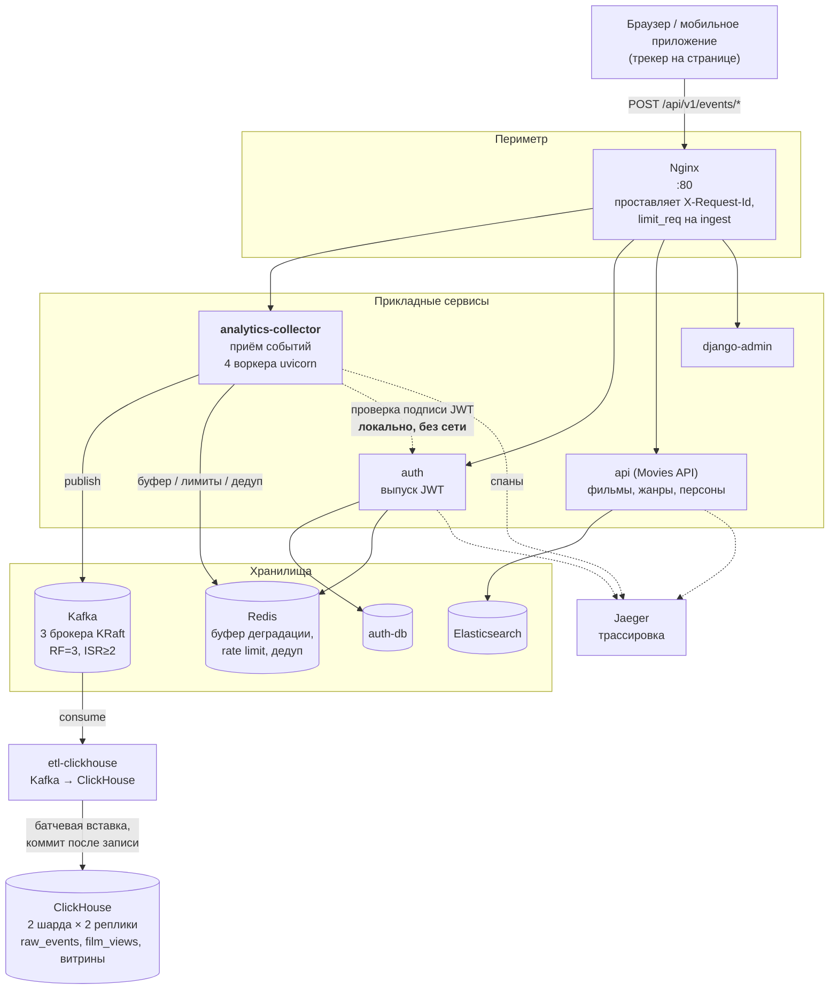
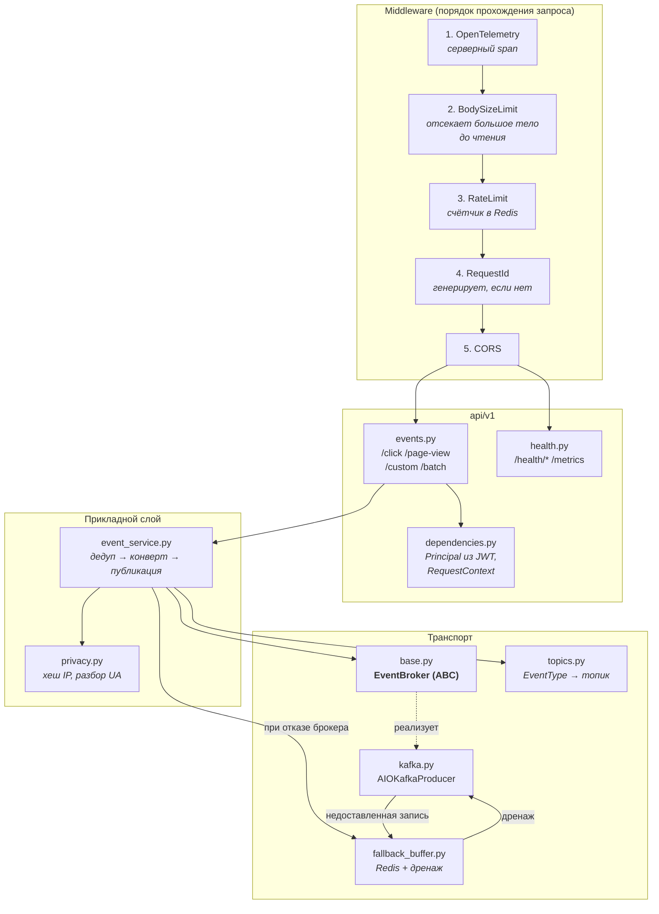
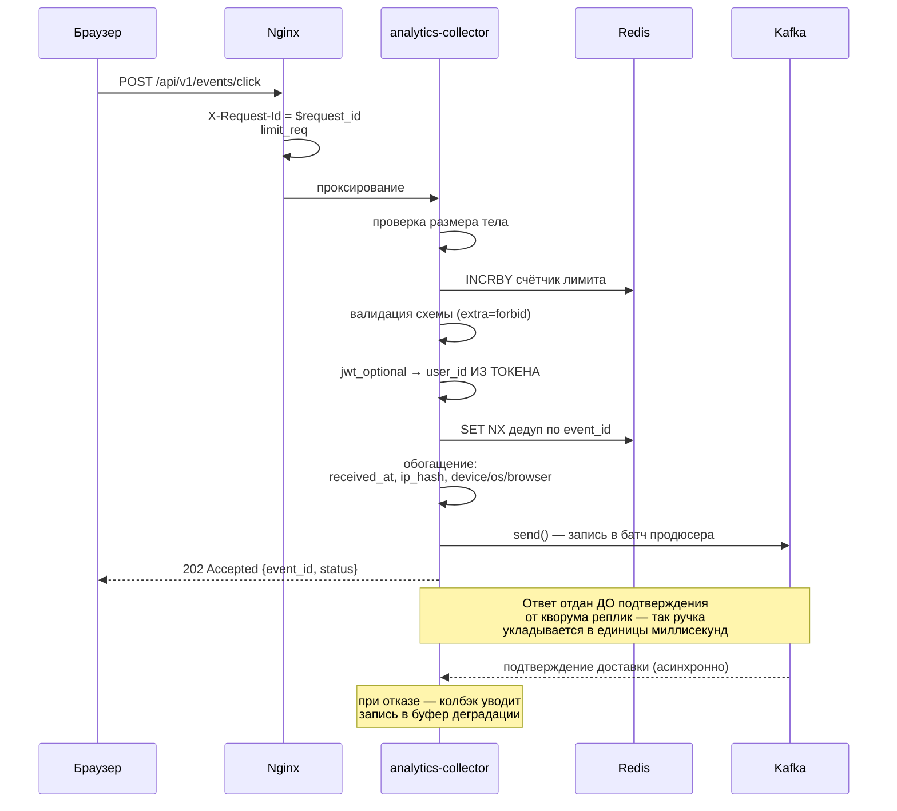
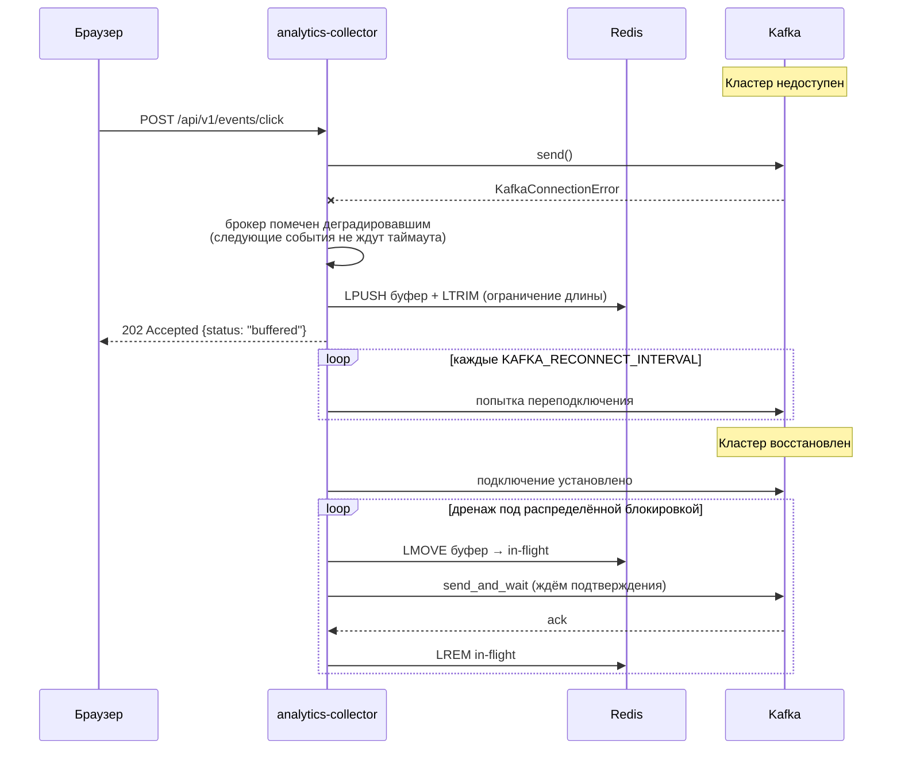
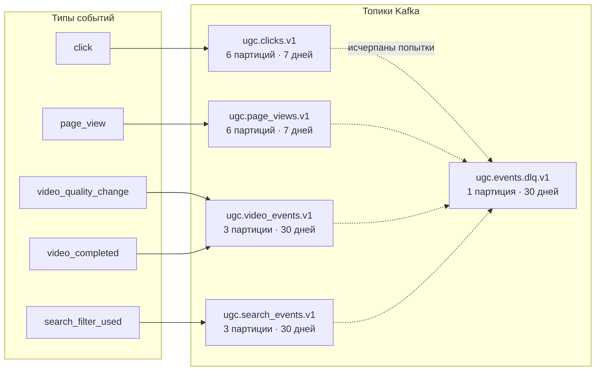
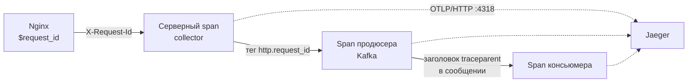
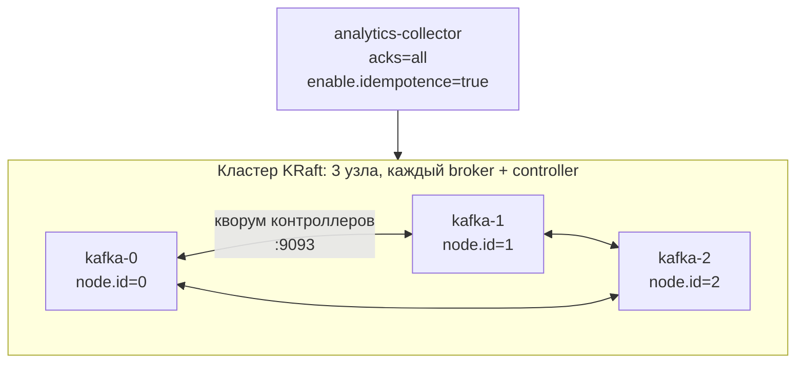

# Архитектура сервиса сбора пользовательских действий

Документ отвечает на вторую подзадачу спринта — отрисовку архитектуры системы,
взаимодействий между сервисами и хранилищами. То, что не выражается графикой
(обоснование выбора ключа партиционирования, гарантии доставки, модель
приватности), описано текстом.

---

## 1. Место сервиса в системе

Пунктирная стрелка от коллектора к Auth намеренно пунктирная: **сетевого
вызова нет**. Коллектор проверяет подпись токена локально общим секретом
(`AUTHJWT_SECRET_KEY`), поэтому недоступность Auth никак не влияет на приём
событий. Единственная фактическая связь с Auth — общий Redis, в котором тот
ведёт денилист отозванных токенов, и обращение к нему тоже необязательное.

---

## 2. Внутреннее устройство сервиса

Сервисный слой зависит от абстракции `EventBroker`, а не от `aiokafka` — тот же
приём инверсии зависимостей, что в `rest/db/base.py`. Практическая польза не
теоретическая: в тестах на место продюсера подставляется брокер, который умеет
падать по команде, и сценарий деградации проверяется без остановки кластера.

---

## 3. Приём события: штатный путь

Осознанный размен: клиент получает `202` раньше, чем брокер подтвердил запись.
Для аналитики это правильно — иначе каждый клик пользователя ждал бы репликации
на два узла. Сохранность обеспечивается не ожиданием, а колбэком на future
доставки: если брокер не подтвердил запись, она уходит в буфер и будет
доставлена дренажом.

---

## 4. Деградация: Kafka недоступна

Ключевая деталь дренажа — **двухфазное извлечение**. Запись не удаляется из
Redis сразу: `LMOVE` атомарно переносит её в отдельный in-flight-список, и
только подтверждённая брокером запись удаляется оттуда через `LREM`. Простой
`RPOP` был бы ошибкой: он удаляет запись до доставки, и падение процесса между
извлечением и публикацией теряет её безвозвратно — ровно в тот момент, когда
буфер и нужен. Записи, оставшиеся в in-flight после аварийного завершения,
возвращаются в очередь при следующем запуске дренажа.

Дренаж захватывает блокировку в Redis (`SET NX EX`): воркеров четыре, а
осмысленно дренировать буфер должен один — иначе они конкурируют за одни и те
же записи и множат нагрузку на восстанавливающийся брокер.

Если недоступен и Redis, событие теряется. Это единственный сценарий потери, и
он всегда виден: счётчик `ugc_events_dropped_total` и запись уровня ERROR.
Отдавать в этом случае 5xx сознательно не стали — сломанная аналитика не должна
ломать сайт.

**Деградация объявляется только по отказу КЛАСТЕРА.** Неудача доставки бывает
свойством конкретной записи: `RecordTooLargeError`, недопустимый топик,
неподдержанный формат сообщения. Повтор такой записи в здоровую Kafka даст
ровно тот же результат, а брокер тут ни при чём — поэтому она считается
`ugc_records_rejected_total`, пишется в ERROR и уезжает в буфер, но флага
здоровья не трогает. Иначе одно «отравленное» сообщение переводило бы продюсер
в degraded, и весь поток шёл бы в Redis до следующего успешного `_probe` при
полностью работающей Kafka. Побочный эффект прежнего поведения был ещё хуже:
уход записи в DLQ требует живого брокера, то есть отравленная запись, сама же
и «сломав» брокер, крутилась в буфере до исчерпания его размера.

Такой отказ отдаётся отдельным типом исключения `RecordRejectedError` (подкласс
`BrokerUnavailableError`): ingest-ручка ведёт себя как прежде — 202 и буфер, —
а дренаж буфера, увидев его, отправляет запись в DLQ сразу, не тратя на неё
`UGC_FALLBACK_MAX_ATTEMPTS` проходов.

---

## 5. Топики и партиционирование

### Почему топик на тип сущности

Из трёх стратегий, разобранных в теории спринта, выбрана вторая.

**Единый топик для всех событий** упрощает глобальный обзор, но лишает
возможности настраивать потоки раздельно: клики и досмотры имеют разный объём,
разную ценность и должны иметь разный retention и разное число партиций. В
едином топике параметры пришлось бы задавать по худшему случаю.

**Топик на экземпляр сущности** неприменим: число топиков росло бы вместе с
числом фильмов и пользователей, а каждый топик на каждую партицию удерживает
файловые дескрипторы — брокеру их попросту не хватило бы. Любая агрегация
превратилась бы в чтение тысяч топиков.

**Топик на тип сущности** ориентирован на будущее: когда появятся события
вендоров или платежей, они станут новыми топиками, не затронув существующие.
При необходимости потоки всегда можно слить в производный топик.

События плеера (`video_quality_change` и `video_completed`) живут в одном
топике намеренно: их анализируют совместно — типичный вопрос «предшествовала ли
обрыву просмотра смена качества» требует обоих потоков, а общий топик и общий
ключ партиционирования гарантируют их взаимный порядок.

### Почему ключ партиционирования — user_id

Из трёх кандидатов, разобранных в теории:

* **По типу события** — отвергнуто. Кардинальность ключа (5 значений) меньше
  числа партиций (6), поэтому часть партиций осталась бы пустой, а самая
  массовая — перегруженной. Кроме того, события уже разделены по топикам, и
  партиционирование по типу внутри топика ничего не даёт.
* **По `session_id`** — даёт хорошее распределение и порядок внутри сессии, но
  теряет связность между сессиями одного пользователя. Вопрос «что делал этот
  пользователь за неделю» потребовал бы чтения всех партиций.
* **По `user_id`** (выбрано) — сохраняет порядок всех событий пользователя, даёт
  равномерное распределение за счёт высокой кардинальности и позволяет
  консьюмеру строить пользовательские агрегаты, читая одну партицию.

Для анонимов, у которых `user_id` нет, ключ деградирует по цепочке
`anonymous_id` → `session_id`. Побочный эффект: после входа пользователя его
события меняют партицию. Это принято сознательно — склейка анонимного и
авторизованного профилей всё равно выполняется в аналитическом хранилище по
`anonymous_id`, а не в Kafka.

---

## 6. Модель приватности

Сервис по своей природе видит чувствительные данные, поэтому объём того, что
попадает в долговременное хранилище, ограничен явно.

| Данные | Что уходит в Kafka | Почему так |
|--------|--------------------|------------|
| IP-адрес | `blake2b(ip, key=соль)`, 32 hex-символа | Аналитике нужно **различать** клиентов, а не знать их адреса. Хеш это даёт, обратное восстановление — нет. Соль в режиме ключа (не приписывания) исключает length-extension; без соли пространство IPv4 перебирается радужной таблицей за минуты. |
| User-Agent | Усечённый до 256 символов + разобранные device/os/browser | Полная строка не ограничена по длине и раздувала бы сообщения. |
| `user_id` | Только из подписанного токена | Клиент не может атрибутировать событие чужому пользователю. |
| Поисковый запрос | Как есть, до 256 символов | Часть бизнес-требования (анализ фильтров поиска). |

Соль обязательна в продакшене: при `UGC_ENV=prod` сервис не стартует со
значением по умолчанию. Падение на старте здесь предпочтительнее тихого сбора
данных с предсказуемым хешем.

---

## 7. Сквозная трассировка

Идентификатор запроса проставляет Nginx, перезаписывая присланное клиентом
значение (защита от подмены). Внутри сервиса он попадает в `ContextVar`, в тег
активного спана, в каждую строку лога и в заголовок сообщения Kafka.
Контекст трассировки (`traceparent`) в заголовки сообщения кладёт
`AIOKafkaInstrumentor` — благодаря этому трейс не обрывается на границе брокера
и спан консьюмера связывается с HTTP-запросом, в котором событие было принято,
даже если между ними прошли часы.

---

## 8. Отказоустойчивость кластера Kafka

Метаданные хранит сам кластер по протоколу Raft — внешний координатор
(ZooKeeper) не нужен. Изменение считается принятым, когда его подтвердило
большинство контроллеров, то есть 2 из 3.

Настройки записи подобраны так, чтобы отказ одного узла не приводил ни к
остановке приёма, ни к потере данных:

* `RF=3` — три копии каждой партиции на разных брокерах;
* `min.insync.replicas=2` — запись подтверждается после репликации на две;
* `acks=all` — продюсер ждёт подтверждения от всех синхронизированных реплик;
* `enable.idempotence=true` — повторы продюсера при сетевых сбоях не порождают
  дубликатов в партиции.

Комбинация переживает потерю одного брокера: остаются две реплики в ISR, чего
достаточно для `min.insync.replicas=2`. Потеря двух брокеров останавливает
запись — и это правильное поведение: продолжать запись в одну реплику значило
бы принимать данные, которые теряются вместе с ней. В этом случае события
уходят в буфер деградации, а не пропадают.
