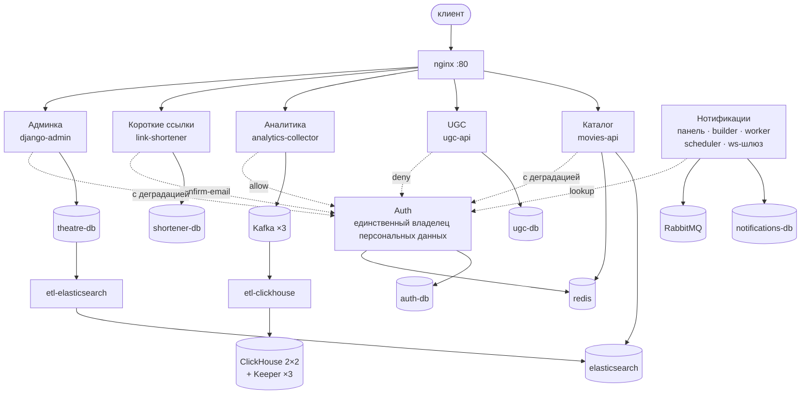
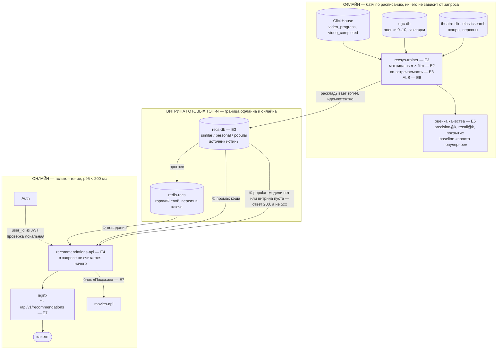
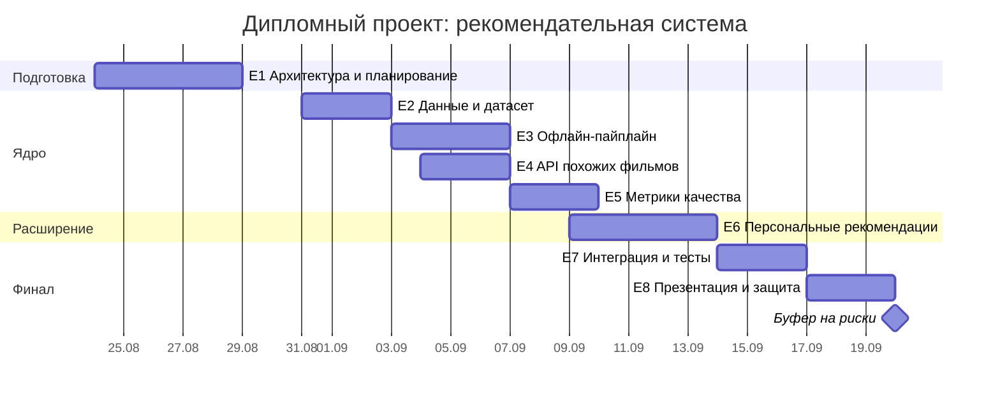

# Дипломный проект: рекомендательная система

Один разработчик, 4 недели. Тема рассчитана на команду из ~4 человек, поэтому
объём сознательно урезан: см. раздел «Что не делаем».

Требования, SLO, расчёт нагрузки и журнал архитектурных решений — в
[`diploma-tz.md`](diploma-tz.md). Здесь — план и схемы.

**Стратегия — waterfall.** План на все четыре недели строится сейчас и
обновляется в начале каждой недели по факту прогресса. Выбор в пользу
водопада, а не Agile: скоуп зафиксирован ТЗ, срок защиты жёсткий и известен
заранее, а диаграмма Ганта строится только при каскадной модели.

## Продуктовые сценарии

1. **Похожие фильмы** — блок на странице фильма, item-to-item по со-просмотрам.
2. **Рекомендуем вам** — персональная выдача на главной, коллаборативная фильтрация.
3. **Холодный старт** — топ популярных за период для нового пользователя и для
   случая «модель не обучилась / кэш пуст». Не украшение, а обязательный путь деградации.

## Источники данных

Собственный сбор данных не требуется — кинотеатр уже пишет всё нужное.

| Сигнал | Где лежит | Тип |
|---|---|---|
| `video_progress`, `video_completed` | ClickHouse, через Kafka | неявный, основной |
| Оценки 0..10 | `ugc-db`, таблица `likes` | явный |
| Закладки | `ugc-db`, таблица `bookmarks` | явный, слабый |
| Жанры, персоны, описания | `theatre-db`, индекс Elasticsearch | контентные признаки |

## Архитектурное решение

Офлайн-обучение плюс онлайн-выдача из подготовленного кэша. Считать рекомендации
в момент запроса нельзя: требование диплома — ответ не дольше 300 мс.

- `recsys-trainer` — батч по расписанию: читает ClickHouse, обучает, раскладывает топ-N.
- `recommendations-api` — только читает готовое.
- Деградация: пустой кэш или несостоявшееся обучение отдают популярное, а не 5xx.

## Архитектура: как есть и как будет

Схемы в векторе — [`images/recsys-current.svg`](images/recsys-current.svg) и
[`images/recsys-target.svg`](images/recsys-target.svg); их же удобнее вставлять
в презентацию к защите.

### Как есть

Девять сервисов, каждый владеет своими данными: общей базы в системе нет, и
рекомендациям её тоже не дадут. Полная карта стенда — в
[`architecture.md`](architecture.md).

### Как будет

Считать рекомендации в момент запроса нельзя, поэтому система разрезана на
офлайн, который думает, и онлайн, который только читает готовое. Витрина
топ-N — шов между ними; в неё пишет ровно один процесс. Стрелки — движение
данных, поэтому чтение нарисовано «сверху вниз», от витрины к выдаче.

## План по неделям

**Дата релиза — 20.09.2026**: день, к которому MVP развёрнуто и показывается
вживую. Буфер на риски — этот же день, намеренно не занятый задачами.

Три внешние контрольные точки, помимо еженедельных демо заказчику: защита
архитектуры и плана перед наставником 30.08 (задача T1.6), демо результатов
код-ревьюеру 13.09 (задача T6.6) и финальная защита (E8). Демо 13.09 приходится
на последний день E6, поэтому оно заведено отдельной задачей, а оценка эпика
поднята с 16 до 18 часов за счёт буфера: иначе подготовка съела бы время самого
эпика.

### Недельная нагрузка

Диаграмма показывает, что идёт за чем, но не показывает, сколько это стоит в
часах. Разработчик один, поэтому сумма важна не меньше порядка.

| Неделя | Эпики | Часов | В день |
|---|---|---|---|
| 1 (24–30.08) | E1 | 16 | 2.3 |
| 2 (31.08–06.09) | E2, E3, E4 | 35 | 5.0 |
| 3 (07–13.09) | E5, E6 | 28 | 4.0 |
| 4 (14–20.09) | E7, E8 | 20 | 2.9 |
| **Всего** | | **99** | **3.5** |

Вторая неделя тяжелее остальных, и это осознанно: на неё приходятся оба
сервиса, а пик — 04–06.09 — это пятница, суббота и воскресенье, где часов
больше, чем в будни. Максимум по дням — 6.5 ч на воскресенье 06.09.

**Третья неделя выросла с 26 до 28 часов** при декомпозиции E5–E8: два часа —
демо код-ревьюеру 13.09 (T6.6). Часы взяты из буфера 20.09, а не отобраны у
разработки: урезать подготовку к встрече, на которой результат и показывается,
значит прийти на неё без аргументов.

**Оценки E3 и E4 пересчитаны вниз** (16→13 и 12→10 ч) относительно первой
редакции плана. Основание — не желание уложиться в срок, а то, что каркасы
`recsys-trainer` и `recommendations-api` (T3.1, T4.1) заводят десятый и
одиннадцатый сервисы **по уже существующему шаблону**: один общий
`infra/docker/python-service.Dockerfile`, один `uv.lock`, готовые проверки
манифестов и графа, логирование и трассировка из `practix_core`. По той же
причине дешевле T3.2 (компоуз-сервис миграций делается по образцу
`ugc-migrations`) и T4.4 (проба доступности хранилища уже вынесена в
`practix_core.health`). Это работа по образцу, а не с нуля, и первая редакция
оценивала её как новую.

Без пересчёта на 04.09 приходилось 8 ч, а на всю вторую неделю — 40 ч при
среднем темпе плана 3.5 ч/день. Альтернативы отвергнуты: сдвиг E4 на третью
неделю переносит горб, а не убирает его (в неделях 3–4 свободно ~5 ч, а E4
весит 10), и наложил бы E6 на E7.

## Что не делаем — и это осознанно

A/B-тесты, дообучение в реальном времени, отдельный feature store, собственный
фронтенд, объяснимость рекомендаций. Всё перечисленное идёт на слайд
«дальнейшее развитие», а не в скоуп четырёх недель.
